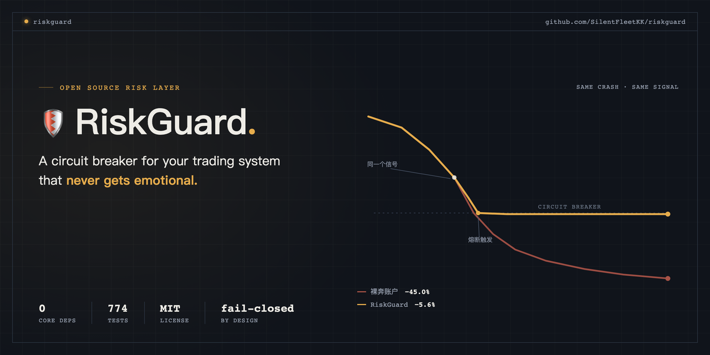

<div align="center">



# 🛡️ RiskGuard

**A 24/7 risk officer for your trading system that never gets emotional.**

[](https://github.com/SilentFleetKK/riskguard/actions/workflows/ci.yml)


> "Rule No. 1: Never lose money. Rule No. 2: Never forget rule No. 1." — Warren Buffett

**[简体中文](README.md)** · English

</div>

Quant trading has five building blocks — **data → research → backtesting → risk control → execution.** Data has OpenBB, research has Qlib, backtesting has backtesting.py/vectorbt, execution has Alpaca. **The risk-control layer is the only one without a mature open-source standard.** RiskGuard exists to fill that gap.

Risk control isn't really a technology problem — it's **discipline you write down in advance and never let yourself override**. RiskGuard turns the handful of rules that stop most blowups into a dependency-free, composable library the system enforces automatically — because the moment you're actually losing money, willpower is the least reliable thing on earth.

<details>
<summary><strong>📖 Table of Contents</strong></summary>

- [Watch It Stop a Blowup (30 Seconds)](#watch-it-stop-a-blowup-30-seconds)
- [Why Not Just Write a Few `if` Statements?](#why-not-just-write-a-few-if-statements)
- [One Risk Layer, This Many Capabilities](#one-risk-layer-this-many-capabilities)
- [60-Second Quickstart](#60-second-quickstart)
- [Dynamic Sizing](#dynamic-sizing-let-the-formula-decide-not-your-emotions)
- [Real-Time Sentinel (Kill-Switch)](#real-time-sentinel-kill-switch)
- [Tamper-Evident Audit Trail](#tamper-evident-audit-trail)
- [State Persistence](#state-persistence-closing-the-restart-to-bypass-the-breaker-loophole)
- [Daily Digest + Stress Test](#daily-digest-stress-test-the-layer-where-ai-watches-your-book)
- [Plug Into Your Backtest Framework](#plug-into-your-backtest-framework)
- [Three Presets + a CLI](#three-presets-a-cli)
- [Architecture](#architecture)
- [Who This Is For / Design Principles / Limits / Roadmap](#who-this-is-for)

</details>

---

## 🔥 Watch It Stop a Blowup (30 Seconds)

Same "go all-in long" signal, fed the same −45% crash. One account has no risk control; the other runs RiskGuard (10% position cap + 15% drawdown breaker). Look at the gap in **max drawdown**:

| | Naive account | 🛡️ RiskGuard account |
|---|---:|---:|
| Position size | 100% | **10% (auto-resized)** |
| Final equity (started at $100k) | $55,000 | **$94,377** |
| **Max drawdown** | **−45.0%** | **−5.6%** |

```text
Same crash. RiskGuard cut max drawdown from 45% to 5.6%.
Discipline doesn't make you richer — it keeps you from wiping out
your account on the worst day of the year.
```

> These numbers are the real output of [`examples/06_with_vs_without.py`](examples/06_with_vs_without.py) — the **mechanical result** of a single position cap, reproducible with one command. Not a return promise. `git clone` it and run it yourself.

### But discipline isn't free

Same config, run against a +200% bull run instead: the guarded account only captures **10%** of the naive account's gain — `$120,000` vs `$300,000`. A position cap truncates **both tails** of the distribution: it blocks the crash, but it also blocks the moonshot. That's a real premium, not fine print (see [`examples/09`](examples/09_the_cost_of_discipline.py)). Whether it's worth it depends on what scares you more — missing a rally, or not surviving to see the next one.

---

## 🤔 Why Not Just Write a Few `if` Statements?

You could. But the hard part of risk control was never "can I write the logic" — it's **analytical rigor and decision discipline**, especially in the exact moment you're losing money and least fit to make decisions.

| What you think is enough | What actually happens | What RiskGuard does instead |
|---|---|---|
| "I'll just remember not to exceed 10%" | The rule is the first thing that breaks down when you're panicking | Written into config, enforced by the system — breach it and it **auto-resizes** |
| "I'll manually cut losses once it drops enough" | You hesitate, you rationalize, you average down instead | Drawdown hits the line and the breaker **trips automatically** |
| "Backtested 30% annual return, looks great" | Slippage and fees eat it alive in production | Paper broker has **built-in slippage + commission** — friction first, then look |
| Falls back to the last known price when a quote is missing | Wrong price = wrong exposure math = risk control silently fails | No price, **no order** — fail-closed, always |
| Treats closing orders the same as opening orders | The breaker blocks the exit too, so risk can never actually shrink | **Reducing a position is always allowed**, no exceptions |
| Logs to a text file | Anyone can edit it after the fact — no proof of anything | **Hash-chained log**, `verify()` catches tampering in one call |
| Restarts the process and keeps trading | High-water mark and breaker state reset to zero — discipline evaporates | State is persistable — **the breaker survives a restart** |

**This was never a "can you write the logic" problem. It's a "can the discipline be enforced by the system" problem.** RiskGuard welds all seven of these into code.

---

## 🧱 One Risk Layer, This Many Capabilities

| Capability | Class | In one line |
|---|---|---|
| 🚫 Position cap | `MaxPositionLimit` | Any symbol's notional exposure ≤ `max_position_pct` of equity (default 10%) — never bet the house on one idea |
| 🧯 Drawdown breaker | `DrawdownCircuitBreaker` | Drawdown hits `max_drawdown_pct` (default 15%) → new orders halt; **reducing positions is always allowed** |
| 🐣 Strategy quarantine | `StrategyQuarantine` | New strategies run small for an observation window (default 90 days) before earning bigger size |
| ⚖️ Portfolio exposure caps | `GrossExposureLimit` / `NetExposureLimit` | Gross caps leverage, net caps directional bias — a pile of individually-compliant small positions still can't add up to a monster |
| 🎲 Dynamic sizing | `KellySizer` / `VolatilityTargetSizer` / `FixedFractionalSizer` | Let a formula decide bet size, not your gut; no positive edge → automatically sizes to zero |
| 🚨 Real-time sentinel | `RiskMonitor` | Background thread watches the book, trips the breaker automatically (cancels + liquidates) — the kill-switch for when you can't be trusted to |
| 🌙 Daily digest / stress test | `build_digest` / `run_stress_test` | Structured summary for an AI agent to narrate; a one-shot "what if it drops 20%" projection, zero side effects |
| 📿 Tamper-evident ledger | `JsonlAuditSink` / `SqliteAuditSink` | Every decision/trip/fill gets a hash-chained record, optional HMAC for real tamper resistance |
| 🔒 State persistence | `SqliteStateStore` | High-water mark and breaker state written to disk — a restart is no longer a loophole |
| 🔌 Pluggable execution layer | `Broker` / `PaperBroker` / `AlpacaBroker` | Paper broker, Alpaca, or your own backend — implement one interface and you're in |

> **Two layers, strictly separated**: `Sizer` decides "how big a bet"; `Rule` decides "can it go through, does it need trimming, should everything stop." AI can research, write code, poke holes in your logic — but **every real order still has to clear these hard-coded rules first.**

---

## ⚡ 60-Second Quickstart

> ⚠️ **Not on PyPI yet** — `pip install riskguard` won't work today. Use the git install below.
> This section gets updated the moment it ships to PyPI (tracked in the [roadmap](#roadmap)).

```bash
pip install git+https://github.com/SilentFleetKK/riskguard.git              # core, zero deps
pip install "riskguard[alpaca] @ git+https://github.com/SilentFleetKK/riskguard.git"  # with the Alpaca adapter
```

```python
from riskguard import RiskEngine, RiskConfig, Order, Side, PaperBroker

# 1) A paper broker with slippage + commission baked in (backtests and
#    live trading are two different worlds — model the friction)
broker = PaperBroker(cash=100_000, slippage_bps=2, commission_bps=1,
                     marks={"AAPL": 200.0})

# 2) Write the discipline into config: 10% position cap, 15% drawdown breaker
engine = RiskEngine(RiskConfig(max_position_pct=0.10, max_drawdown_pct=0.15),
                    broker=broker)

# 3) Try to buy 1000 shares = $200k = 200% of equity — RiskGuard resizes it
decision = engine.check(Order("AAPL", Side.BUY, 1000), broker.get_portfolio())
print(decision.decision)          # Decision.RESIZE
print(decision.order.quantity)    # 50.0  ← trimmed to the 10% cap
print(decision.reasons())
# AAPL capped to 10.00% of equity (qty 1000 -> 50); gross exposure capped ... (qty 1000 -> 500)
# ↑ multiple rules can fire at once; the engine takes the most conservative one (min = 50)

# 4) If approved, actually submit it (to the paper broker here)
engine.submit(Order("AAPL", Side.BUY, 40), broker.get_portfolio())
```

Once the breaker trips, it requires a **human review** before `engine.reset_breaker()` — no restarts allowed until you've actually understood why it fired.

---

## 🎲 Dynamic Sizing: Let the Formula Decide, Not Your Emotions

```python
from riskguard import KellySizer, Signal, Side

engine = RiskEngine(RiskConfig(kelly_fraction=0.5), sizer=KellySizer(), broker=broker)

# Kelly needs win probability and payoff ratio: f = kelly_fraction × (p − q/b)
sig = Signal("AAPL", Side.BUY, price=200.0, win_probability=0.55, payoff_ratio=1.5)
engine.size_and_submit(sig, broker.get_portfolio())   # no positive edge -> returns None, sizes to nothing
```

- `FixedFractionalSizer` — a fixed fraction, the hardest one to lie to yourself with.
- `KellySizer` — fractional Kelly; full Kelly is too wild to actually trade, so it defaults to half.
- `VolatilityTargetSizer` — target vol / realized vol, giving every position an equal risk budget.

## 🚨 Real-Time Sentinel (Kill-Switch)

Writing discipline into config isn't enough by itself — the market doesn't pause while you're asleep, in a meeting, or off the grid. `RiskMonitor` is a background thread that never blinks: it watches the account on an interval and trips the brakes automatically the moment a line is crossed.

```python
from riskguard import RiskMonitor

with RiskMonitor(engine, broker, interval=5.0, auto_liquidate=True):
    ...   # background thread: observes equity on a timer -> trips the breaker
          # and liquidates once the drawdown line is crossed
```

## 📿 Tamper-Evident Audit Trail

```python
from riskguard import RiskEngine, JsonlAuditSink

with JsonlAuditSink("audit.jsonl", hmac_key="a key kept outside the log") as audit:
    engine = RiskEngine(broker=broker, audit=audit)
    ...

JsonlAuditSink.verify("audit.jsonl", hmac_key="...", expected_count=42)   # prove it wasn't tampered with
```

> **Being honest about the limits**: a plain hash chain with no key only catches edits/reordering of records *in the middle* of the log — it can't catch someone truncating the tail or rewriting the whole file. For real tamper-resistance, pass an `hmac_key` (kept outside the log) and call `verify(expected_count=N)` with an external count as your anchor.

## 🔒 State Persistence: Closing the "Restart to Bypass the Breaker" Loophole

`RiskState` is in-memory by default — restart the process and the high-water mark and breaker flag both reset to zero, handing anyone who just blew up their account a one-line escape hatch: "restart and keep trading." That's a direct contradiction of the whole point of this library. Wire in a `state_store` and the breaker actually survives a restart (see [`examples/10`](examples/10_state_persistence.py)):

```python
from riskguard import RiskEngine, SqliteStateStore

store = SqliteStateStore("risk_state.db")
engine = RiskEngine(config, broker=broker, state_store=store)
# On construction, it automatically restores the high-water mark, breaker
# state, and strategy inception times from the store; every state change
# after that gets written through. A failed read raises immediately —
# it would rather refuse to start than quietly pretend everything's fine.
```

The CLI supports the same persistence across invocations (otherwise a script that calls it repeatedly is itself a "restart to bypass" loophole). Use `--state-key` to isolate multiple strategies/symbols sharing one database file:

```bash
$ riskguard check --state-db risk_state.db --state-key strategy_a \
    --equity 80000 --side buy --qty 10 --price 100
```

> **Being honest about the limits**: this closes the single most common bypass — restarting the process. It's not bulletproof. Someone determined enough can still delete the store file, change the config, or edit the source. It raises the cost of cheating, it doesn't eliminate it — for an individual trader, risk control is ultimately a Ulysses pact with yourself, not the separation-of-duties you'd get inside an institution.
>
> **Only one active writer per `(store file, key)`**: two engines sharing the same key get caught by optimistic locking (a version-number CAS) and error out — they never silently clobber each other's state. Use distinct keys for multiple strategies/accounts.

## 🌙 Daily Digest + Stress Test: The Layer Where AI Watches Your Book

"AI watches your positions 24/7" breaks down into four layers: real-time monitoring, anomaly detection, a hard-coded circuit breaker, and stress testing. **The hard-coded breaker** is what RiskGuard has been doing since line one (everything above is that). This section fills in the two pieces of the other layers that **actually belong inside this library's scope**: **daily digest** (turning "real-time monitoring" into a summary you can recompute and check) and **stress test** (turning "what if..." into an actual projection).

> **What this deliberately does not do**: statistical/AI-driven anomaly detection — deciding "this time feels different" — doesn't belong in this library. That's a data-science problem (it needs historical baselines, news/sentiment feeds, model scoring), and it's a fundamentally different kind of product from RiskGuard's "deterministic, fail-closed, never make a fuzzy judgment call" design philosophy. That layer belongs to an external AI agent: the agent observes, judges, and narrates; RiskGuard's only job is to guarantee the facts it hands over are real, and to execute without hesitation the instant a rule fires. **That line does not get decided by AI.**

```python
from riskguard.reporting import build_digest, render_digest_text, run_stress_test, render_stress_text

# Daily digest: engine state (high-water mark / breaker / quarantined
# strategies) + a portfolio snapshot, assembled into a structured summary
report = build_digest(engine, portfolio)
print(render_digest_text(report))
report.to_dict()   # structured data — hand it to an AI agent to narrate or push as an alert

# Stress test: "if my positions all drop 20% tomorrow, do I survive?"
# — strictly read-only, zero side effects
result = run_stress_test(engine, portfolio, shock_pct=-0.20)
print(render_stress_text(result))
```

The CLI supports the same thing, useful for scripted "daily check-in" and "let me just ask" workflows ([`examples/11`](examples/11_daily_digest.py), [`examples/12`](examples/12_stress_test.py)):

```bash
$ riskguard digest --equity 95000 --position AAPL:80:190 --position TSLA:-40:250 --state-db risk.db
$ riskguard stress --equity 95000 --shock -0.20 --position AAPL:80:190 --position TSLA:-40:250
```

> **Note**: today the CLI's own text output is Chinese-only — it hasn't been localized yet (see the [roadmap](#roadmap)). The library itself (rule messages, decisions, everything you'd call from Python) is English throughout; only the `riskguard` command-line tool's printed text is still Chinese.
>
> **The stress test's read-only promise**: it never trips the breaker, never writes to the audit log, never touches persistence — even if `--state-db` points at a file that doesn't exist yet, it won't leave a new file on disk. It's a pure "what if" — run it, get an answer, done.

## 🔌 Plug Into Your Backtest Framework

Wire RiskGuard in as a "risk overlay" on top of backtesting.py / vectorbt, so **strategy research and blowup protection finally run on the same pipeline** ([`examples/07`](examples/07_backtest_overlay.py)).

```python
# Framework-agnostic overlay: target position -> risk-approved order;
# also runs a one-line "guarded vs naive" comparison
from riskguard.backtest import RiskOverlay, compare

res = compare(prices, my_strategy, config=RiskConfig(max_position_pct=0.10))
print(res["naive"].max_drawdown, res["guarded"].max_drawdown)  # e.g. −45% vs −5.6%
```

```python
# backtesting.py: subclass just implements signal() -> target weight,
# orders automatically clear risk control
from riskguard.backtest import make_riskguard_strategy
class MyStrat(make_riskguard_strategy(RiskConfig(max_position_pct=0.10))):
    def signal(self): return 1.0 if bullish else 0.0
```

```python
# vectorbt: cap position sizes at the limit (pure function, works even
# without vectorbt installed)
from riskguard.backtest import risk_capped_weights, kelly_weights
size = risk_capped_weights(target_weights, RiskConfig(max_position_pct=0.10))
```

## 🎚️ Three Presets + a CLI

Don't want to tune every parameter by hand? Start from a preset — **conservative / balanced / aggressive**:

```python
from riskguard import get_preset, RiskEngine
engine = RiskEngine(get_preset("conservative"))   # or "balanced" / "aggressive"
# then config.replace(...) to fine-tune it into your own house rules
```

Once installed, there's also a **zero-dependency command-line tool** for a quick sanity check, browsing presets, or a one-line comparison:

```bash
$ riskguard check --preset balanced --equity 100000 --side buy --qty 1000 --price 200
裁决:  RESIZE
放行:  BUY 50 ASSET  (占权益 10.0%)

$ riskguard presets                               # side-by-side preset comparison
$ riskguard replay --prices 100,96,90,82,75,70    # guarded vs naive drawdown comparison
```

> Same note as above: the CLI's own printed output (`裁决` = "decision", `放行` = "approved") is currently Chinese-only. The Python library underneath it is English throughout.

---

## 🗺️ Architecture

```
                Signal ──Sizer──┐     RiskOverlay (backtest overlay) / reporting (digest · stress)
    Kelly · Vol Target · Fixed  │     different callers of the same RiskEngine — read-only or hypothetical
                                ▼
                              Order
                                │
                                ▼
            ┌────────────────────────────────────────────┐
            │          RiskEngine                        │
            │  Rules    allow / resize                   │
            │  Breaker  halt everything?                 │
            │  State   ⇄  StateStore (persisted)         │
            └───────────────────┬────────────────────────┘
                                │ approved order (thread-safe, locked)
                                ▼
                       Broker abstraction ── PaperBroker / AlpacaBroker / your own

     📿 Audit (JSONL/SQLite, optional HMAC) · 🚨 RiskMonitor (kill-switch, talks to Broker directly)
```

## 🙋 Who This Is For

- You already use backtesting.py / vectorbt / your own execution layer, and you're missing a risk middleware that **doesn't lock you into any framework**
- You want an AI agent to research and trade for you, but you **won't let it touch real money unsupervised** — RiskGuard is the gate the AI can't route around
- You've blown up an account once, or fought a battle of ego with the market once, and you want "discipline" out of your head and into code instead of relying on willpower
- You need a risk middleware that can plug into Alpaca or a backend you built yourself
- You want a project that was "built from scratch, with real tests and paper-trading battle scars" as a portfolio piece

## 🧭 Design Principles

1. **Discipline is written down, and the system enforces it.** Every threshold lives in `RiskConfig` — immutable, validated at startup.
2. **Never fail silently.** No price → raise, not guess. Bad price → discard it, not use it. Fail-closed, always.
3. **Reducing risk is always allowed.** Nothing ever blocks risk from shrinking — not mid-breaker, not even a position flip, which gets clamped to flat instead.
4. **Everything is immutable.** Data objects are read-only, state changes return new snapshots, history is always replayable — safe to share across a monitoring thread.
5. **AI thinks, the system enforces.** AI can research, write code, poke holes in your logic — but every real order still has to clear the hard-coded rules first.
6. **Discipline survives a restart.** Breaker state can be persisted; a restart is not a legitimate way around risk control.

## ⚠️ Honest Limits & Disclaimer

- This is a **risk-control tool, not investment advice**, and it **does not guarantee profit or prevent losses**. It constrains exposure and enforces discipline — it does not predict markets.
- Any strategy should run on paper for **at least three months** before real money. And real money should only ever be money you can afford to lose without it affecting your life or your sleep.
- The comparison numbers above come from **deterministic simulation scripts** — the mechanical result of a position cap, not a forecast of future returns. This project **does not ship, and does not claim, any live trading track record**.
- Audit tamper-resistance has real, stated limits (see above) — don't treat it as unbreakable.
- **This library does not do anomaly detection or read the market.** No news feed, no sentiment analysis, no "this time feels different" judgment calls. It does exactly one thing: execute the hard rules you set, without hesitation.

## 🚧 Roadmap

- [ ] Ship to PyPI (`pip install riskguard` actually installs)
- [ ] Alpaca adapter, live end-to-end (orders/positions/cancels)
- [ ] More brokers: Interactive Brokers, crypto exchanges via ccxt
- [x] Daily digest + stress test
- [x] State persistence: closing the "restart bypasses the breaker" loophole
- [x] CI (pytest matrix + ruff)
- [x] Config presets + CLI: conservative/balanced/aggressive + command line
- [x] One-line integration with backtesting.py / vectorbt
- [ ] External anchoring for the audit trail (WORM / notarization)
- [ ] The AI-agent gate trio: intraday loss limit, fat-finger price collar, order-rate throttling
- [ ] Localize the CLI's own output (it's Chinese-only right now; the library itself is already English)

Full version history lives in [CHANGELOG](CHANGELOG.md).

## 🛠️ Development

```bash
pip install -e ".[dev]"
pytest            # 774 passed, CI runs 3.10-3.13
ruff check src     # clean
mypy src           # strict mode, still has known gaps (typing is in progress, not yet a CI gate)
```

## 📄 License

MIT. Issues and PRs welcome.

<div align="center">

If it's ever saved you from a blowup, a ⭐ would mean a lot.

[](https://star-history.com/#SilentFleetKK/riskguard&Date)

</div>
